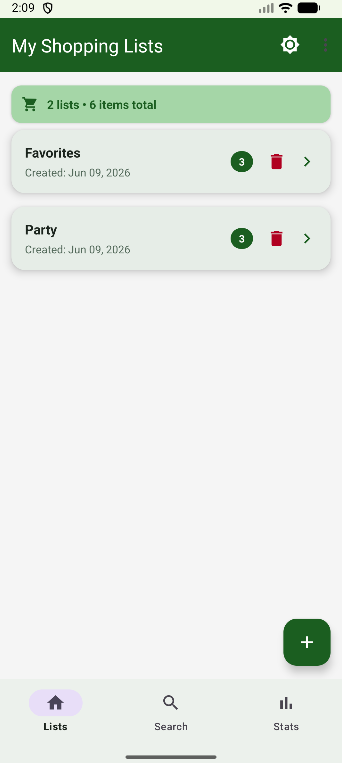
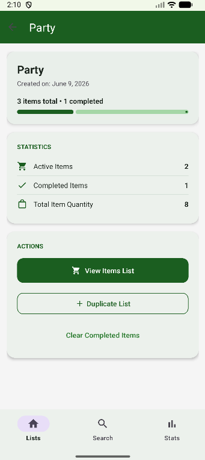
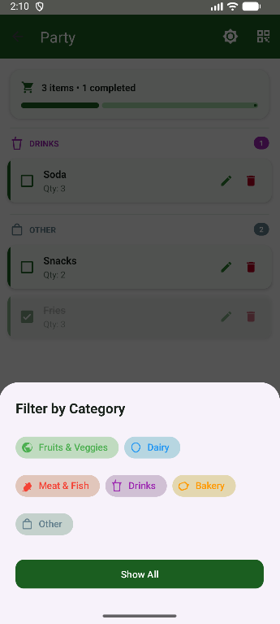
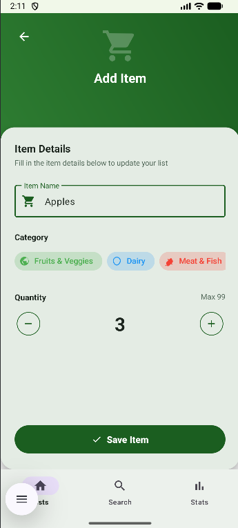
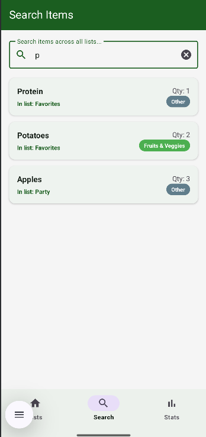
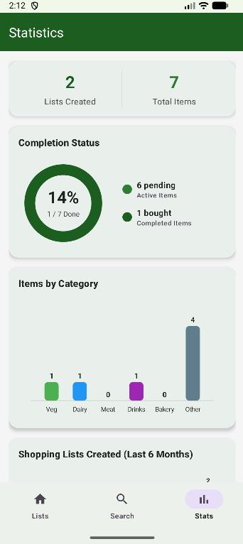
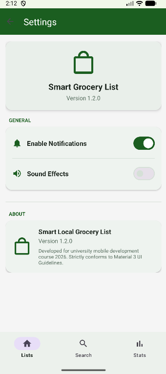
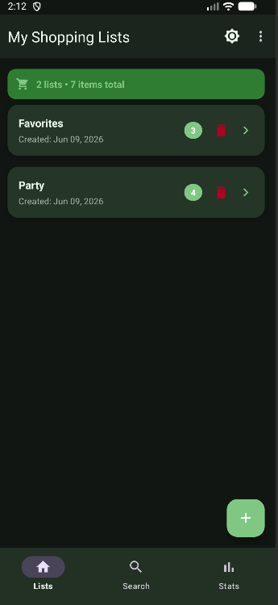

# Споделен Списък за Пазаруване (Smart Grocery List)

Документация на приложението **SharedGroceryApp**. Това е модерно мобилно приложение за управление, търсене и споделяне на списъци за пазаруване, изградено с **Kotlin** и проектирано изцяло според **Material 3 UI Guidelines**.

---

## Идея
Основната идея на приложението е да предостави интуитивен, красив и изключително бърз начин за управление на ежедневните покупки. Приложението решава проблема с разхвърляните списъци, като въвежда автоматично сортиране по продуктови категории, визуализация на прогреса, детайлна статистика и възможност за лесно офлайн споделяне чрез автоматично генериране на **QR кодове**.

---

## Как работи
Приложението управлява списъци за пазаруване чрез Room база данни. Потребителят създава списъци и добавя артикули с конкретно количество и категория. Данните се записват локално. Категориите се визуализират динамично с индивидуални цветове и икони, а артикулите в списъка се групират с филтрация по категории. Статистиката агрегира данните в реално време с три персонализирани Canvas диаграми: кръгова (прогрес), стълбовидна (продукти по категории) и линейна (създадени списъци за 6 месеца). Вградената търсачка извършва пълнотекстово търсене по име на продукт във всички списъци с история. Списъците могат да се дублират (клониране на артикули) или споделят посредством генериран QR код, който кодира структурата на продуктите и количествата им за сканиране от други устройства.

---

## Архитектура (MVVM)
Приложението е разработено по чистия архитектурен модел **MVVM (Model-View-ViewModel)** с реактивен поток на данните:
- **Model**: Room компонентите (`GroceryDatabase`, `GroceryDao`, `GroceryItem`, `ShoppingList`) осигуряват надеждна реактивна база данни. `GroceryRepository` абстрахира източника на данни.
- **ViewModel**: `GroceryViewModel` управлява състоянието на екраните и експонира корутинни потоци (`StateFlow`, `SharedFlow`).
- **View**: Фрагментите (`HomeListsFragment`, `GroceryListFragment`, `ListDetailFragment`, `SearchFragment`, `StatisticsFragment`, `SettingsFragment`) се абонират за ViewModel потоците и обновяват интерфейса.

### Пример за модел на данни (Entity)
```kotlin
package com.example.sharedgroceryapp.data.local

import androidx.room.Entity
import androidx.room.PrimaryKey

@Entity(tableName = "grocery_items")
data class GroceryItem(
    @PrimaryKey(autoGenerate = true) val id: Int = 0,
    val listId: Int,
    val name: String,
    val quantity: Int,
    val isBought: Boolean,
    val category: String = "Other"
)
```

### Технологичен стек и версии
| Технология / Библиотека | Версия | Описание |
| --- | --- | --- |
| **Kotlin** | `1.9.0` | Основен език за разработка |
| **Android SDK** | `Target SDK 36 / Min SDK 24` | Поддържани версии на операционната система |
| **Room Database** | `2.6.1` | Реактивна локална SQLite база данни |
| **Navigation Component** | `2.7.7` | Навигация с типова безопасност (Safe Args) |
| **Material Components** | `1.12.0` | Модерен Material 3 интерфейс и компоненти |
| **ZXing Embedded** | `4.3.0` | Библиотека за визуализиране и кодиране на QR кодове |

---

## Потребителски поток
1. **Начален екран (Lists)**: Потребителят вижда своите списъци. С натискане на бутона `+` се отваря модерен диалог (Bottom Sheet) за създаване на нов списък.
2. **Детайли за списък (List Details)**: При клик върху списък се зарежда Hero екран с прогрес и статистика. Оттук потребителят може да отвори продуктите, да изчисти купените продукти, да дублира списъка или да генерира QR код за споделяне.
3. **Управление на продукти (Items List)**: Екранът групира продуктите по категории. Потребителят може да отметне купените продукти (получават зачеркнат текст и намалена прозрачност) или да ги филтрира по категории.
4. **Добавяне / Редактиране**: Отваря се форма за въвеждане на име, избор на категория (чрез хоризонтална лента с чипове) и избор на количество (чрез интерактивни бутони `-` / `+`).
5. **Търсене (Search)**: Достъпно от долната навигационна лента. Позволява пълнотекстово търсене на продукти във всички списъци, поддържа история на скорошни търсения с бързи чипове.
6. **Статистика (Stats)**: Визуализира разпределението на продуктите и активността на потребителя през последните месеци на Canvas диаграми.
7. **Настройки (Settings)**: Потребителят управлява известия, звуци и разглежда информация за приложението.

---

## Стъпки за стартиране
За да стартирате и тествате проекта локално:
1. Клонирайте хранилището в локална директория.
2. Отворете проекта в **Android Studio (Koala или по-нова)**.
3. Сглобете проекта с Gradle:
   ```bash
   ./gradlew assembleDebug
   ```
4. Стартирайте локалните unit тестове:
   ```bash
   ./gradlew testDebugUnitTest
   ```
5. Стартирайте автоматизираните Espresso UI тестове (необходим е стартиран емулатор):
   ```bash
   ./gradlew connectedAndroidTest
   ```

---

## Тестови акаунти
Приложението работи изцяло в **офлайн режим** и съхранява всички списъци и настройки локално в криптирана SQL база данни на устройството (Room). **Не се изисква създаването на профил, онлайн акаунт или интернет връзка**, за да се използват функциите на приложението.

---

## Скрийншотове
1. **Начален екран**
   
   
2. **Детайли за списък**
   
   
3. **Списък с продукти**
   
   
4. **Добавяне и редактиране на продукт**
   
   
5. **Търсене**
   
   
6. **Статистика**
   
   
7. **Настройки на приложението**
   
   
8. **Тъмна тема**
   

---

## APK
Готовият инсталационен файл е компилиран и тестван. Може да го намерите директно в директорията `apk` на хранилището или да го свалите от следния линк:

👉 [Свалете app-release.apk оттук](apk/app-release.apk) (Размер: ~6.2 MB)